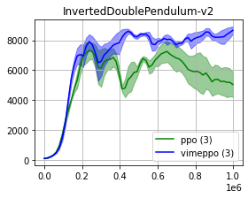

# vime-pytorch

This repo contains the PyTorch implementation of two Reinforcement Learning algorithms:

* PPO (Proximal Policy Optimization) ([paper](https://arxiv.org/abs/1707.06347))
* VIME (Variational Information Maximizing Exploration) ([paper](https://arxiv.org/abs/1605.09674))

The code is based upon [openai/baselines](https://github.com/openai/baselines)
and the implementation of PPO is taken from [ikostrikov/pytorch-a2c-ppo-acktr-gail](https://github.com/ikostrikov/pytorch-a2c-ppo-acktr-gail/).

## Requirements

* Python 3
* [PyTorch](http://pytorch.org/)
* [OpenAI baselines](https://github.com/openai/baselines)

In order to install requirements, follow:

```bash
# Baselines for Atari preprocessing
git clone https://github.com/openai/baselines.git
cd baselines
pip install -e .

# Other requirements
pip install -r requirements.txt
```

If you don't have mujoco installed, follow the intructions [here](https://github.com/openai/mujoco-py).

## Instructions

In order to run InvertedDoublePendulum-v2 with VIME, you can use the following command:

```bash
python main.py --env-name InvertedDoublePendulum-v2 --algo vime-ppo --use-gae --log-interval 1 --num-steps 2048 --num-processes 1 --lr 3e-4 --entropy-coef 0 --value-loss-coef 0.5 --ppo-epoch 10 --num-mini-batch 32 --gamma 0.99 --num-env-steps 1000000 --use-linear-lr-decay --no-cuda --log-dir /tmp/doublependulum/vimeppo/vimeppo-0 --seed 0 --use-proper-time-limits --eta 0.01
```
   
Instead, to run experiments with PPO, just replace `vime-ppo` with `ppo`.

## Results




#### Note:

Any gym-compatible environment can be run, but the hyperparameters have not been tested for all of them. 

However, the parameters used with the InvertedDoublePendulum-v2 example in the Instructions are, generally, good enough for other mujoco environments. 

## TODO:

* Refactor code
* More experiments
* Integrate more args into the command line